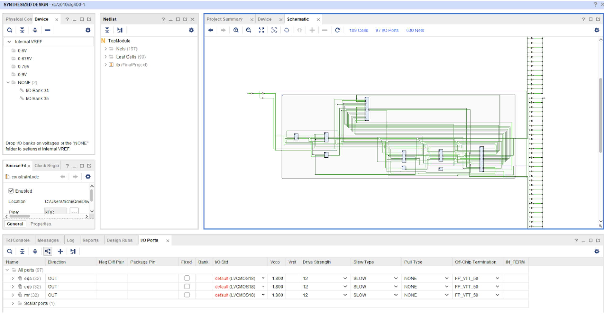
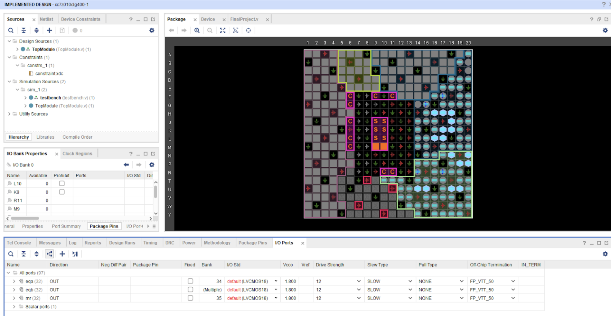
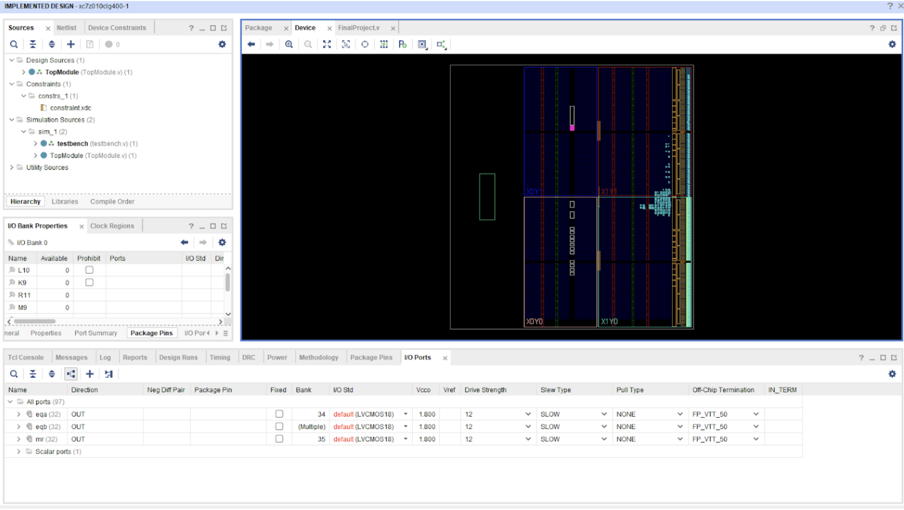
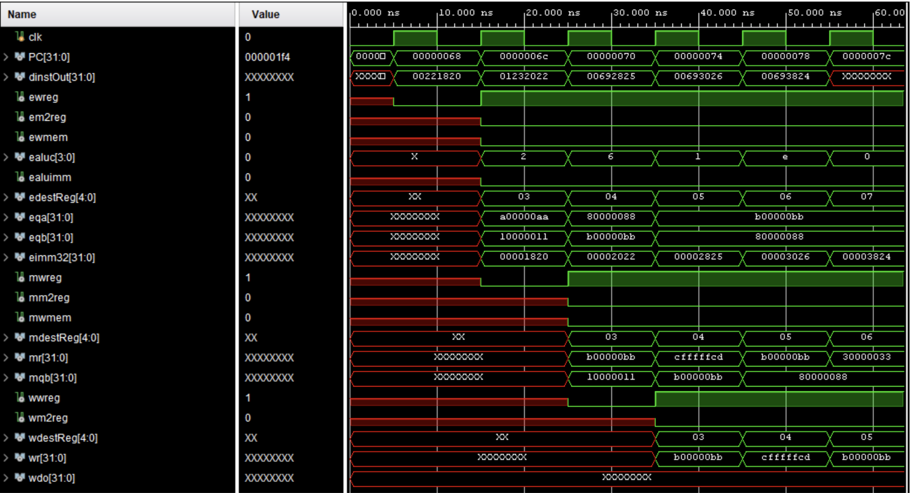

## Project Overview

This project implements a complete 5-stage pipelined CPU based on the MIPS instruction set architecture, demonstrating fundamental concepts of modern processor design including instruction-level parallelism, hazard detection, and data forwarding mechanisms.

**Design Goal:** Build a functional pipelined processor that executes MIPS instructions with minimal stalls

**Key Features:**
- Classic 5-stage pipeline (IF, ID, EX, MEM, WB)
- Data forwarding to minimize pipeline stalls
- Load-use hazard detection and stalling
- Separate instruction and data memories
- Successfully synthesized and deployed to Xilinx FPGA

---

## Pipeline Architecture

### The Five Stages

**1. Instruction Fetch (IF)**
- Program Counter (PC) maintains current instruction address, initialized to address 100
- Instruction memory fetches 32-bit instruction at PC
- PC incremented by 4 each cycle for word-aligned addressing

**2. Instruction Decode (ID)**
- Control Unit decodes opcode and function fields to generate control signals
- Register File reads two source operands (rs, rt) simultaneously
- Immediate values sign-extended from 16 bits to 32 bits
- Forwarding multiplexers select correct operand sources based on hazard detection

**3. Execute (EX)**
- ALU Mux selects second operand from register or sign-extended immediate
- ALU performs arithmetic or logical operation
- Supports: ADD, SUB, AND, OR, XOR

**4. Memory Access (MEM)**
- Data memory read/write for load/store instructions
- Pass-through for arithmetic operations (ALU result forwarded directly)

**5. Write Back (WB)**
- WB Mux selects between ALU result and memory data
- Result written back to Register File destination

### Pipeline Diagram

```
┌─────────┐    ┌─────────┐    ┌─────────┐    ┌─────────┐    ┌─────────┐
│   IF    │───▶│   ID    │───▶│   EX    │───▶│   MEM   │───▶│   WB    │
│ Fetch   │    │ Decode  │    │ Execute │    │ Memory  │    │ Write   │
└─────────┘    └─────────┘    └─────────┘    └─────────┘    └─────────┘
     │              │              │              │              │
     └──────────────┴──────────────┴──────────────┴──────────────┘
                         Forwarding Paths
```

---

## Hazard Handling Implementation

### Data Hazards

**Problem:** Subsequent instructions may need data before it has been written back to the register file.

**Example Hazard:**
```assembly
add $3, $1, $2    # $3 = $1 + $2 (result ready after EX stage)
sub $4, $9, $3    # Needs $3 immediately (not yet written back!)
```

### Solution 1: Data Forwarding

Routes data directly from later pipeline stages back to earlier stages, bypassing the register file entirely.

**Forwarding Logic (Verilog):**
```verilog
// EX Hazard - Forward ALU result from EX/MEM register
if ((ewreg == 1'b1) && (edestReg != 5'b0) && 
    (edestReg == rs) && (em2reg == 1'b0)) begin
    fwda = 2'b01;
end

// MEM Hazard - Forward ALU result from MEM/WB register
else if ((mwreg == 1'b1) && (mdestReg != 5'b0) && 
         (mdestReg == rs) && (mm2reg == 1'b0)) begin
    fwda = 2'b10;
end

// MEM Hazard - Forward memory data from MEM/WB register
else if ((mwreg == 1'b1) && (mdestReg != 5'b0) && 
         (mdestReg == rs) && (mm2reg == 1'b1)) begin
    fwda = 2'b11;
end

else begin
    fwda = 2'b00;  // No hazard - use register file
end
```

**Forwarding Multiplexer:**
```verilog
module ForwardMux(
    input [31:0] regOut,
    input [31:0] r,
    input [31:0] mr,
    input [31:0] mdo,
    input [1:0] fwd,
    output reg [31:0] q
);

always @(*) begin
    case (fwd)
        2'd0: q = regOut;   // No forwarding - use register file data
        2'd1: q = r;        // Forward from EX/MEM (ALU result)
        2'd2: q = mr;       // Forward from MEM/WB (ALU result)
        2'd3: q = mdo;      // Forward from MEM/WB (memory data)
    endcase
end

endmodule
```

**Result:** Eliminates most data hazards without any pipeline stalls. Forwarding logic is applied independently to both operand A (rs) and operand B (rt).

---

### Solution 2: Pipeline Stalling

For load-use hazards, forwarding alone is not sufficient because memory data is unavailable until the end of the MEM stage. The pipeline must stall for one cycle to allow the data to propagate.

**Load-Use Hazard Example:**
```assembly
lw  $3, 0($1)     # Load $3 from memory (data ready end of MEM)
add $4, $3, $5    # Needs $3 in EX (one cycle too early!)
```

**Stalling Logic (Verilog):**
```verilog
// Detect load-use hazard: EX stage contains load and current instruction reads that register
if ((ewreg == 1'b1) && (em2reg == 1'b1) && (edestReg != 5'b0) && 
    ((edestReg == rs) || (edestReg == rt))) begin
    wreg = 1'b0;    // Convert current instruction to NOP
    wmem = 1'b0;
    wpcir = 1'b0;   // Freeze PC and IF/ID register for one cycle
end
else begin
    wpcir = 1'b1;   // Normal operation - advance pipeline
end
```

**How it works:** When a load-use hazard is detected, the Control Unit sets `wpcir` to 0, which simultaneously freezes the Program Counter and the IF/ID pipeline register. The ID/EX register receives a bubble (NOP) for one cycle, allowing the load data to reach the MEM/WB stage where it can then be forwarded.

---

### Structural Hazards

**Problem:** Multiple instructions competing for the same hardware resource simultaneously.

**Solution:** Instruction and data memories are implemented as completely separate modules. The IF stage reads from instruction memory while the MEM stage reads/writes data memory in the same cycle with no conflicts.

---

## Control Unit Design

The Control Unit is the most complex module in the design, responsible for decoding instructions, generating all control signals, detecting hazards, and computing forwarding paths.

### Control Signals Generated

| Signal | Purpose | Values |
|--------|---------|--------|
| `wreg` | Write register enable | 1 = write result to register file |
| `m2reg` | Memory to register | 1 = load instruction (write memory data) |
| `wmem` | Write memory enable | 1 = store instruction |
| `aluc[3:0]` | ALU operation select | 0010=ADD, 0110=SUB, 0000=AND, 0001=OR, 1110=XOR |
| `aluimm` | ALU operand B select | 1 = use sign-extended immediate, 0 = use register |
| `regrt` | Destination register select | 1 = rt (I-type), 0 = rd (R-type) |
| `fwda[1:0]` | Forward control for operand A | Source selection for rs |
| `fwdb[1:0]` | Forward control for operand B | Source selection for rt |
| `wpcir` | Pipeline advance control | 0 = stall, 1 = advance |

### Instruction Decode Logic

```verilog
module ControlUnit(
    input [5:0] op,
    input [5:0] func,
    input [4:0] rs,
    input [4:0] rt,
    input [4:0] mdestReg,
    input mm2reg,
    input mwreg,
    input [4:0] edestReg,
    input em2reg,
    input ewreg,
    output reg wreg,
    output reg m2reg,
    output reg wmem,
    output reg [3:0] aluc,
    output reg aluimm,
    output reg regrt,
    output reg [1:0] fwda,
    output reg [1:0] fwdb,
    output reg wpcir
);

always @(*) begin
    case (op)
        6'b000000: begin    // R-type instructions
            wreg = 1'b1;
            m2reg = 1'b0;
            wmem = 1'b0;
            aluimm = 1'b0;
            regrt = 1'b0;   // Write to rd

            case (func)
                6'b100000: aluc = 4'b0010;  // ADD
                6'b100010: aluc = 4'b0110;  // SUB
                6'b100100: aluc = 4'b0000;  // AND
                6'b100101: aluc = 4'b0001;  // OR
                6'b100110: aluc = 4'b1110;  // XOR
            endcase
        end

        6'b100011: begin    // LW - Load Word
            wreg = 1'b1;
            m2reg = 1'b1;
            wmem = 1'b0;
            aluc = 4'b0010;
            aluimm = 1'b1;
            regrt = 1'b1;   // Write to rt
        end
    endcase
end

endmodule
```

---

## Complete Module Implementations

### Program Counter

```verilog
module ProgramCounter(
    input [31:0] nextPC,
    input wpcir,
    input clk,
    output reg [31:0] PC
);

initial begin
    PC = 32'd100;   // Start at address 100
end

always @(posedge clk) begin
    if (wpcir == 1'b1)
        PC <= nextPC;   // Only update when not stalled
end

endmodule
```

### PC Adder

```verilog
module PCAdder(
    input [31:0] PC,
    output reg [31:0] nextPC
);

always @(*) begin
    nextPC = PC + 32'd4;    // Word-aligned increment
end

endmodule
```

### Instruction Memory

```verilog
module InstructionMemory(
    input [31:0] PC,
    output reg [31:0] instOut
);

reg [31:0] instMemory [0:63];

initial begin
    instMemory[25] = {6'b000000, 5'd1, 5'd2, 5'd3, 5'b00000, 6'b100000};  // add $3, $1, $2
    instMemory[26] = {6'b000000, 5'd9, 5'd3, 5'd4, 5'b00000, 6'b100010};  // sub $4, $9, $3
    instMemory[27] = {6'b000000, 5'd3, 5'd9, 5'd5, 5'b00000, 6'b100101};  // or  $5, $3, $9
    instMemory[28] = {6'b000000, 5'd3, 5'd9, 5'd6, 5'b00000, 6'b100110};  // xor $6, $3, $9
    instMemory[29] = {6'b000000, 5'd3, 5'd9, 5'd7, 5'b00000, 6'b100100};  // and $7, $3, $9
end

always @(*) begin
    instOut = instMemory[PC[31:2]];  // Word-aligned access (PC / 4)
end

endmodule
```

### IF/ID Pipeline Register

```verilog
module IFIDReg(
    input [31:0] instOut,
    input wpcir,
    input clk,
    output reg [31:0] dinstOut
);

always @(posedge clk) begin
    if (wpcir == 1'b1)
        dinstOut <= instOut;    // Holds value when stalled
end

endmodule
```

### Register File

```verilog
module RegFile(
    input [4:0] rs,
    input [4:0] rt,
    input [4:0] wdestReg,
    input [31:0] wbData,
    input wwreg,
    input clk,
    output reg [31:0] qa,
    output reg [31:0] qb
);

reg [31:0] regfile [0:31];

initial begin
    regfile[0]  = 32'h00000000;
    regfile[1]  = 32'hA00000AA;
    regfile[2]  = 32'h10000011;
    regfile[3]  = 32'h20000022;
    regfile[4]  = 32'h30000033;
    regfile[5]  = 32'h40000044;
    regfile[6]  = 32'h50000055;
    regfile[7]  = 32'h60000066;
    regfile[8]  = 32'h70000077;
    regfile[9]  = 32'h80000088;
    regfile[10] = 32'h90000099;
end

// Asynchronous dual-port read
always @(*) begin
    qa = regfile[rs];
    qb = regfile[rt];
end

// Synchronous write on negative edge
always @(negedge clk) begin
    if (wwreg == 1'b1)
        regfile[wdestReg] <= wbData;
end

endmodule
```

### Immediate Extender

```verilog
module ImmExtender(
    input [15:0] imm,
    output reg [31:0] imm32
);

always @(*) begin
    imm32 = {{16{imm[15]}}, imm[15:0]};  // Sign extend bit 15 to 32 bits
end

endmodule
```

### ID/EX Pipeline Register

```verilog
module IDEXEReg(
    input wreg, m2reg, wmem,
    input [3:0] aluc,
    input aluimm,
    input [4:0] destReg,
    input [31:0] qa, qb, imm32,
    input clk,
    output reg ewreg, em2reg, ewmem,
    output reg [3:0] ealuc,
    output reg ealuimm,
    output reg [4:0] edestReg,
    output reg [31:0] eqa, eqb, eimm32
);

always @(posedge clk) begin
    ewreg    <= wreg;
    em2reg   <= m2reg;
    ewmem    <= wmem;
    ealuc    <= aluc;
    ealuimm  <= aluimm;
    edestReg <= destReg;
    eqa      <= qa;
    eqb      <= qb;
    eimm32   <= imm32;
end

endmodule
```

### ALU Multiplexer

```verilog
module ALUMux(
    input ealuimm,
    input [31:0] eqb,
    input [31:0] eimm32,
    output reg [31:0] b
);

always @(*) begin
    if (ealuimm == 1'b0)
        b = eqb;        // R-type: use register value
    else
        b = eimm32;     // I-type: use immediate
end

endmodule
```

### Arithmetic Logic Unit

```verilog
module ALU(
    input [3:0] ealuc,
    input [31:0] eqa,
    input [31:0] b,
    output reg [31:0] r
);

always @(*) begin
    case(ealuc)
        4'b0010: r = eqa + b;   // ADD
        4'b0110: r = eqa - b;   // SUB
        4'b0000: r = eqa & b;   // AND
        4'b0001: r = eqa | b;   // OR
        4'b1110: r = eqa ^ b;   // XOR
    endcase
end

endmodule
```

### EX/MEM Pipeline Register

```verilog
module EXEMEMReg(
    input ewreg, em2reg, ewmem,
    input [4:0] edestReg,
    input [31:0] r, eqb,
    input clk,
    output reg mwreg, mm2reg, mwmem,
    output reg [4:0] mdestReg,
    output reg [31:0] mr, mqb
);

always @(posedge clk) begin
    mwreg    <= ewreg;
    mm2reg   <= em2reg;
    mwmem    <= ewmem;
    mdestReg <= edestReg;
    mr       <= r;
    mqb      <= eqb;
end

endmodule
```

### Data Memory

```verilog
module DataMemory(
    input [31:0] mr,
    input [31:0] mqb,
    input mwmem,
    input clk,
    output reg [31:0] mdo
);

reg [31:0] DataMem [0:63];

initial begin
    DataMem[0] = 32'hA00000AA;
    DataMem[1] = 32'h10000011;
    DataMem[2] = 32'h20000022;
    DataMem[3] = 32'h30000033;
    DataMem[4] = 32'h40000044;
    DataMem[5] = 32'h50000055;
    DataMem[6] = 32'h60000066;
    DataMem[7] = 32'h70000077;
    DataMem[8] = 32'h80000088;
    DataMem[9] = 32'h90000099;
end

// Asynchronous read
always @(*) begin
    mdo = DataMem[mr[31:2]];
end

// Synchronous write on negative edge
always @(negedge clk) begin
    if (mwmem == 1'b1)
        DataMem[mr] <= mqb;
end

endmodule
```

### MEM/WB Pipeline Register

```verilog
module MEMWBReg(
    input mwreg, mm2reg,
    input [4:0] mdestReg,
    input [31:0] mr, mdo,
    input clk,
    output reg wwreg, wm2reg,
    output reg [4:0] wdestReg,
    output reg [31:0] wr, wdo
);

always @(posedge clk) begin
    wwreg    <= mwreg;
    wm2reg   <= mm2reg;
    wdestReg <= mdestReg;
    wr       <= mr;
    wdo      <= mdo;
end

endmodule
```

### Write-Back Multiplexer

```verilog
module WBMux(
    input wm2reg,
    input [31:0] wr,
    input [31:0] wdo,
    output reg [31:0] wbData
);

always @(*) begin
    if (wm2reg == 1'b0)
        wbData = wr;    // ALU result
    else
        wbData = wdo;   // Memory data (load)
end

endmodule
```

### Register RT Multiplexer

```verilog
module RegrtMux(
    input regrt,
    input [4:0] rt,
    input [4:0] rd,
    output reg [4:0] destReg
);

always @(*) begin
    if (regrt == 1'b0)
        destReg = rd;   // R-type: destination is rd
    else
        destReg = rt;   // I-type: destination is rt
end

endmodule
```

---

## Top-Level Module

The main module instantiates and wires all components across the five pipeline stages:

```verilog
module FinalProject(
    input clk,
    output [31:0] PC,
    output [31:0] dinstOut,
    output ewreg, em2reg, ewmem,
    output [3:0] ealuc,
    output ealuimm,
    output [4:0] edestReg,
    output [31:0] eqa, eqb, eimm32,
    output mwreg, mm2reg, mwmem,
    output [4:0] mdestReg,
    output [31:0] mr, mqb,
    output wwreg, wm2reg,
    output [4:0] wdestReg,
    output [31:0] wr, wdo
);

// Internal wires
wire [31:0] nextPC, instOut, imm32, ra, rb, r, mdo, qa, qb, b, wbData;
wire wpcir, wreg, m2reg, wmem, aluimm, regrt;
wire [3:0] aluc;
wire [1:0] fwda, fwdb;
wire [4:0] destReg;

// IF Stage
ProgramCounter    pc0(nextPC, wpcir, clk, PC);
PCAdder           pa0(PC, nextPC);
InstructionMemory im0(PC, instOut);
IFIDReg           fdr0(instOut, wpcir, clk, dinstOut);

// ID Stage
ControlUnit cu0(dinstOut[31:26], dinstOut[5:0], dinstOut[25:21], dinstOut[20:16],
               mdestReg, mm2reg, mwreg, edestReg, em2reg, ewreg,
               wreg, m2reg, wmem, aluc, aluimm, regrt, fwda, fwdb, wpcir);
RegrtMux    rgm0(regrt, dinstOut[20:16], dinstOut[15:11], destReg);
ForwardMux  fwm0(ra, r, mr, mdo, fwda, qa);
ForwardMux  fwm1(rb, r, mr, mdo, fwdb, qb);
ImmExtender ie0(dinstOut[15:0], imm32);
IDEXEReg    der0(wreg, m2reg, wmem, aluc, aluimm, destReg, qa, qb, imm32, clk,
                ewreg, em2reg, ewmem, ealuc, ealuimm, edestReg, eqa, eqb, eimm32);

// EX Stage
ALUMux      alum0(ealuimm, eqb, eimm32, b);
ALU         alu0(ealuc, eqa, b, r);
EXEMEMReg   emr0(ewreg, em2reg, ewmem, edestReg, r, eqb, clk,
                 mwreg, mm2reg, mwmem, mdestReg, mr, mqb);

// MEM Stage
DataMemory  dm0(mr, mqb, mwmem, clk, mdo);
MEMWBReg    mwr0(mwreg, mm2reg, mdestReg, mr, mdo, clk,
                 wwreg, wm2reg, wdestReg, wr, wdo);

// WB Stage
WBMux       wbm0(wm2reg, wr, wdo, wbData);
RegFile     rf0(dinstOut[25:21], dinstOut[20:16], wdestReg, wbData, wwreg, clk, ra, rb);

endmodule
```

---

## Test Program & Verification

The CPU executes a 5-instruction test program that exercises forwarding between consecutive instructions:

```assembly
add $3, $1, $2    # $3 = 0xA00000AA + 0x10000011 = 0xB00000BB
sub $4, $9, $3    # $4 = $9 - $3  → triggers forwarding from previous ADD
or  $5, $3, $9    # $5 = $3 | $9  → triggers forwarding
xor $6, $3, $9    # $6 = $3 ^ $9  → triggers forwarding
and $7, $3, $9    # $7 = $3 & $9  → triggers forwarding
```

### Testbench

```verilog
module testbench();

reg clk;
wire [31:0] PC, dinstOut;
wire ewreg, em2reg, ewmem;
wire [3:0] ealuc;
wire ealuimm;
wire [4:0] edestReg;
wire [31:0] eqa, eqb, eimm32;
wire mwreg, mm2reg, mwmem;
wire [4:0] mdestReg;
wire [31:0] mr, mqb;
wire wwreg, wm2reg;
wire [4:0] wdestReg;
wire [31:0] wr, wdo;

FinalProject fp0(
    .clk(clk), .PC(PC), .dinstOut(dinstOut),
    .ewreg(ewreg), .em2reg(em2reg), .ewmem(ewmem),
    .ealuc(ealuc), .ealuimm(ealuimm), .edestReg(edestReg),
    .eqa(eqa), .eqb(eqb), .eimm32(eimm32),
    .mwreg(mwreg), .mm2reg(mm2reg), .mwmem(mwmem),
    .mdestReg(mdestReg), .mr(mr), .mqb(mqb),
    .wwreg(wwreg), .wm2reg(wm2reg), .wdestReg(wdestReg),
    .wr(wr), .wdo(wdo)
);

initial begin
    clk <= 1'b0;
end

always begin
    #5;
    clk = ~clk;     // 10ns clock period (100 MHz)
end

endmodule
```

---

## FPGA Implementation

### Target Device
**Xilinx XC7Z010-CLG400-1** (Zynq-7000 SoC)

### Development Workflow

**1. RTL Design** — Implemented each pipeline stage as an independent Verilog module with clear interfaces between stages.

**2. Simulation & Verification** — Developed testbench to drive clock and monitor all pipeline register outputs across every stage. Validated instruction execution and forwarding behavior via waveform analysis.

**3. Synthesis** — Converted RTL Verilog to gate-level netlist using Xilinx Vivado. Design schematic generated post-synthesis confirms correct module hierarchy.

**4. Implementation** — Mapped synthesized netlist to physical FPGA resources. I/O planning and floor planning completed successfully.

**5. Bitstream Generation** — Bitstream generated successfully, confirming design is ready for hardware deployment.

**6. Hardware Validation** — Design programmed onto XC7Z010 FPGA and verified on physical hardware.


### Implementation Results







---

## Simulation Results

### Waveform Analysis



**Key Observations:**
- Pipeline fills over first 5 clock cycles as instructions progress through stages
- Forwarding control signals (fwda, fwdb) activate automatically when data hazards are detected
- All 5 instructions complete with correct results
- Register file updates reflect expected computed values

---

## Lessons Learned

### Technical Insights

**Pipeline Design:**
- Separating control logic and data paths simplifies verification and debugging
- Pipeline registers are critical — they define stage boundaries and enable parallelism
- Hazard detection logic in the Control Unit adds significant complexity but is essential for correctness

**Verilog Best Practices:**
- Modular design with one module per component makes debugging tractable
- Consistent signal naming across pipeline stages prevents wiring errors
- Comments clarifying intent (not just syntax) are essential for complex control logic

**FPGA Development:**
- Simulation catches the majority of bugs before synthesis — invest time here
- Successful bitstream generation confirms timing closure and resource feasibility
- Separating memories eliminates an entire class of structural hazard problems

### Engineering Trade-offs

**Performance vs. Complexity:**
Forwarding eliminates most data hazard stalls but introduces additional multiplexer delays in the critical path. The trade-off is worthwhile — throughput improvement far outweighs the small increase in cycle time.

**Modular vs. Monolithic Design:**
Breaking the CPU into 15+ independent modules made development and debugging significantly more manageable compared to a single large module, at the cost of more interconnect wiring.

---

## Future Enhancements

**Near-Term:**
1. Branch prediction to reduce control hazard penalties
2. Expanded instruction set (shift, jump, and branch instructions)
3. Exception and interrupt handling

**Advanced:**
4. Instruction and data caches to reduce memory latency
5. Out-of-order execution for higher IPC
6. Multi-cycle instructions (multiply, divide)
7. Superscalar architecture with multiple issue slots

---

## Project Files

**GitHub Repository:** [github.com/jacobfrancis/fpga-pipelined-mips-cpu](https://github.com/yourusername/fpga-pipelined-mips-cpu)

**Files Included:**
- Complete Verilog source code (all modules)
- Testbench
- Synthesis and implementation screenshots
- Architecture documentation
- Quick start guide

---

## Conclusion

This project implements a fully functional 5-stage pipelined MIPS processor from RTL design through FPGA deployment. The design successfully resolves data hazards through a combination of forwarding — which bypasses results directly between pipeline stages — and selective stalling for load-use cases where forwarding is insufficient. Separate instruction and data memories eliminate structural hazards entirely.

The complete development cycle from Verilog HDL through Vivado synthesis, implementation, and bitstream generation demonstrates end-to-end FPGA design methodology. The modular architecture provides a strong foundation for future enhancements such as branch prediction and expanded instruction set support.

---

*Project completed as part of Computer Organization and Design coursework at Penn State University, Fall 2025. Successfully synthesized and deployed to Xilinx XC7Z010 FPGA.*
