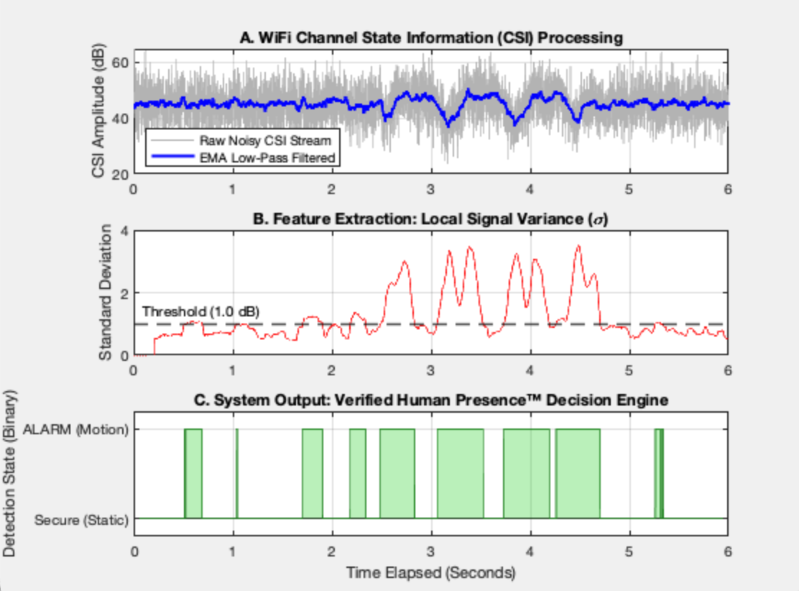

## System Architecture & Workflow

The simulation models a real-world edge-computing system processing raw wireless signal disruptions caused by human movement.


```

+--------------------+      +-------------------------+      +-----------------------+
|   Simulated WiFi   | ---> |   Embedded EMA Filter   | ---> |    Rolling Variance   |
|  CSI Noise Stream  |      |  (Low-Pass Smoothing)   |      | (Feature Extraction)  |
+--------------------+      +-------------------------+      +-----------------------+
|
v
+-----------------------+
| Binary Classification |
|  (Static vs. ALARM)   |
+-----------------------+

```

* **Synthetic Data Generation:** Generates a stable baseline CSI magnitude ($45 \text{ dB}$) at $1000 \text{ Hz}$ sampling rate. Human motion is modeled via overlaid low-frequency wave shifts ($1.5 \text{ Hz}$ and $3.0 \text{ Hz}$) between $t = 2.5\text{s}$ and $t = 4.5\text{s}$.
* **Noise Injection:** Applies White Gaussian Noise manually derived to hit a strict target $18 \text{ dB}$ Signal-to-Noise Ratio (SNR).
* **DSP Smoothing:** Employs a recursive first-order Exponential Moving Average (EMA) low-pass filter ($\alpha = 0.05$).
* **Feature Extraction:** Calculates rolling standard deviation using a sliding 200ms time-window to isolate signal variance.
* **Thresholding & Decision Engine:** Runs an automated binary check against an empirical threshold ($1.0$) to flag real-time intrusions.

---

## Pipeline Visualizations

Execute the script locally in MATLAB to generate the live interactive plot window.

### A. CSI Filtering Performance
The raw, noisy wireless signal stream is aggressively smoothed by the embedded-ready EMA filter, stripping high-frequency channel noise while preserving the macro-scale motion curve.

### B. Variance Profiling & Thresholding
By calculating local signal standard deviation ($\sigma$), the framework quantifies environmental instability. The system automatically triggers when localized variance breaches the $1.0\text{ dB}$ threshold line.

### C. Binary Decision Engine
The end-to-end framework maps variance anomalies into a definitive, actionable binary alert state, successfully isolating human interaction from static environmental background noise.



---

## Source Code

```matlab
%% WiFi CSI Motion Detection and Signal Processing Simulator
% Author: Jacob Francis
% Description: Simulates wireless Channel State Information (CSI) amplitude 
%              tracking, injects channel noise via randn, applies an 
%              embedded-ready Exponential Moving Average (EMA) low-pass filter, 
%              and implements an automated variance threshold to detect human 
%              presence. Zero toolboxes used. 
clear; clc; close all;

%% 1. Parameter Definitions
Fs = 1000;                  % Sampling frequency (Hz) - 1000 packets per second
duration = 6;               % Total signal duration (seconds)
t = 0:(1/Fs):duration-(1/Fs); % Time vector
N = length(t);              % Number of data samples

% Define baseline WiFi CSI amplitude (Steady State environment)
baseline_amplitude = 45;    % Base channel magnitude in dB

%% 2. Generate Simulated CSI Data Stream
% Initialize clean CSI signal
csi_raw = baseline_amplitude * ones(size(t));

% Simulate a "Human Motion Event" between t = 2.5s and t = 4.5s
motion_start = 2.5 * Fs;
motion_end = 4.5 * Fs;
motion_window = motion_start:motion_end;

% Model human movement as a combination of low-frequency wave shifts
motion_signature = 4 * sin(2 * pi * 1.5 * t(motion_window)) + ...
                   2 * cos(2 * pi * 3.0 * t(motion_window));
csi_raw(motion_window) = csi_raw(motion_window) + motion_signature;

%% 3. Inject High-Frequency Wireless Noise (Pure Math)
target_snr_db = 18; 
signal_power = mean(csi_raw.^2);                  
noise_power = signal_power / (10^(target_snr_db/10)); 
noise_std = sqrt(noise_power);                    

% Generate white Gaussian noise using base randn
noise = noise_std * randn(size(t));
csi_noisy = csi_raw + noise;

%% 4. Digital Signal Processing (Embedded EMA Low-Pass Filter)
% An Exponential Moving Average acts as a first-order recursive digital low-pass filter.
% Perfect for embedded microcontrollers because it requires no matrix math.
alpha = 0.05; % Smoothing factor (lower = heavier filtering, equivalent to low cutoff)
csi_filtered = zeros(size(csi_noisy));
csi_filtered(1) = csi_noisy(1); % Initialize first point
for k = 2:N
    csi_filtered(k) = alpha * csi_noisy(k) + (1 - alpha) * csi_filtered(k-1);
end

%% 5. Feature Extraction & Automated Motion Detection Windowing
% Compute a rolling standard deviation using a sliding matrix window
window_size = 0.2 * Fs; % 200ms sliding window
rolling_std = zeros(size(csi_filtered));
for i = window_size:N
    % Isolate the current window data chunk
    window_data = csi_filtered(i-window_size+1:i);
    
    % Manual standard deviation calculation to bypass any toolbox constraints
    mu = mean(window_data);
    rolling_std(i) = sqrt(mean((window_data - mu).^2));
end

% Set an empirical threshold for human presence classification
detection_threshold = 1.0; 
motion_detected = rolling_std > detection_threshold;

%% 6. Graphical Visualization Engine
figure('Name', 'Sensing Simulation Pipeline', 'NumberTitle', 'off');

% Subplot 1: Raw Noisy WiFi Signal vs. Filtered Signal
subplot(3, 1, 1);
plot(t, csi_noisy, 'Color', [0.7 0.7 0.7], 'LineWidth', 0.5); hold on;
plot(t, csi_filtered, 'b-', 'LineWidth', 2);
title('A. WiFi Channel State Information (CSI) Processing');
ylabel('CSI Amplitude (dB)');
legend('Raw Noisy CSI Stream', 'EMA Low-Pass Filtered', 'Location', 'southwest');
grid on;

% Subplot 2: Feature Extraction (Rolling Standard Deviation)
subplot(3, 1, 2);
plot(t, rolling_std, 'r-', 'LineWidth', 1.5); hold on;
yline(detection_threshold, 'k--', 'Threshold (1.0 dB)', 'LineWidth', 1.5, 'LabelHorizontalAlignment', 'left');
title('B. Feature Extraction: Local Signal Variance (\sigma)');
ylabel('Standard Deviation');
grid on;

% Subplot 3: Automated Binary Classification (Output Decision)
subplot(3, 1, 3);
area(t, motion_detected, 'FaceColor', [0.1 0.8 0.1], 'FaceAlpha', 0.3, 'EdgeColor', [0.1 0.5 0.1]);
ylim([-0.2 1.2]);
title('C. System Output: Verified Human Presence™ Decision Engine');
xlabel('Time Elapsed (Seconds)');
ylabel('Detection State (Binary)');
set(gca, 'YTick', [0 1], 'YTickLabel', {'Secure (Static)', 'ALARM (Motion)'});
grid on;

%% 7. Terminal Operations Log Summary
fprintf('====================================================\n');
fprintf('     WORKFLOW PROCESSING COMPLIANCE       \n');
fprintf('====================================================\n');
fprintf('Total Frame Length Processed : %d Samples\n', N);
fprintf('Target Channel SNR Configured: %d dB\n', target_snr_db);
fprintf('DSP Low-Pass Filter Topology : Embedded-Ready EMA (Alpha=0.05)\n');
if any(motion_detected)
    fprintf('System Flag Status           : [MOTION DETECTED]\n');
    fprintf('Analysis Result              : Verified Human Presence Confirmed.\n');
else
    fprintf('System Flag Status           : [SECURE]\n');
    fprintf('Analysis Result              : No Human-Scale Variance Anomalies Isolated.\n');
end
fprintf('====================================================\n');

```

---

## How to Execute

1. Ensure you have base MATLAB installed (compatible with versions R2018a through current releases). No external packages required.
2. Download or clone this workspace.
3. Open MATLAB and navigate to the project directory.
4. Run the file by clicking Run or entering the following command in the Command Window:
```matlab
wifi_csi_motion_simulator

```


```

```
